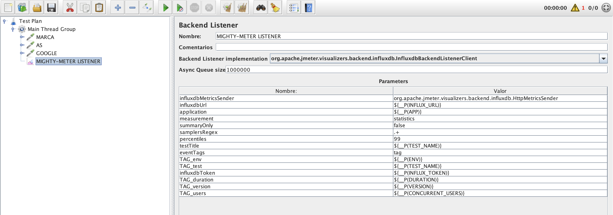
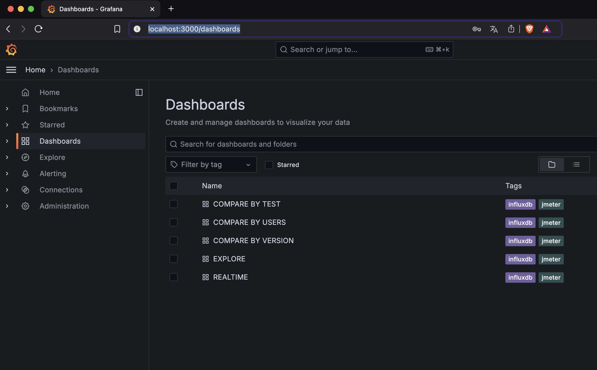
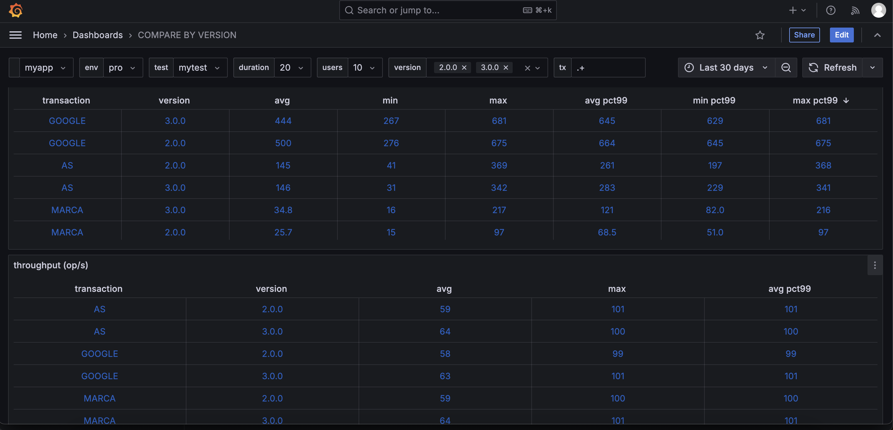
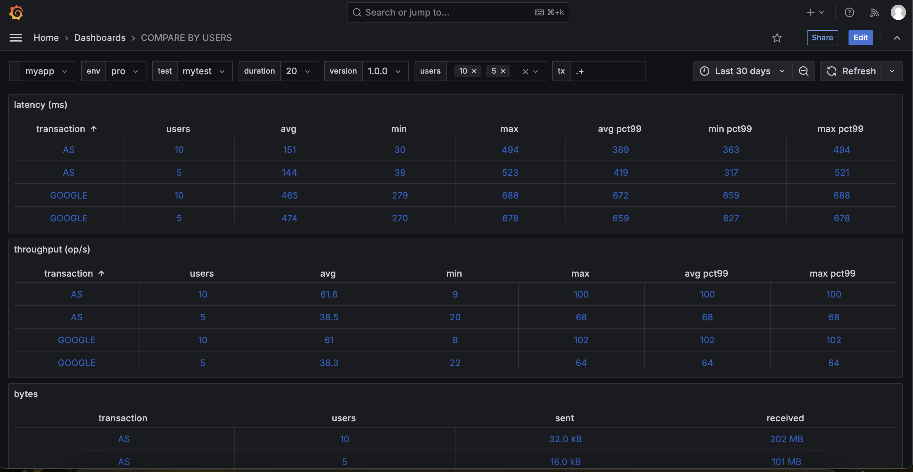

# MightyMeter

- [Introduction](#intro)
- [Requirements](#req)
- [Installation of the Leader](#leader-install)
- [Installation of the Workers](#worker-install)
- [Configuring Your JMX File](#jmx-config)
- [Running Tests](#running-tests)
- [Grafana Dashboards](#grafana-dashboards)
- [Querying the Database](#querying-db)
- [Configuration Options](#config-options)
- [Additional Commands](#additional-commands)
- [Common Issues](#common-issues)

## <a name="intro"></a> Introduction

MightyMeter is a powerful performance testing solution that leverages
[InfluxDB](https://www.influxdata.com/), [Grafana](https://grafana.com/), and
[JMeter](https://jmeter.apache.org/) to support both local and distributed testing modes. Here’s a
closer look at its two operational modes:

### 1. Local CLI Mode

In local testing, it’s recommended to run JMeter in CLI (Command Line Interface) mode instead of the
GUI. The CLI mode is more efficient for executing tests and conserving resources, which makes it
ideal for performance evaluation. While JMeter’s GUI mode is highly useful for creating and
modifying `.jmx` test files, the CLI mode ensures stable, reliable execution when running actual
tests.

### 2. Distributed Testing Mode

MightyMeter facilitates a straightforward setup for distributed testing with multiple JMeter
servers. In this configuration, a central **Leader** node (or master node) coordinates multiple
**Worker** nodes (or slave nodes). The Leader node distributes the test configurations to each
Worker, and as the test runs, each Worker sends its results back to the Leader. This mode is
particularly valuable for large-scale tests and scenarios requiring load generation from multiple
locations or servers.

### Key Features in Both Modes:

- **Result Persistence:** Test results are stored in an InfluxDB database, providing a durable and
  structured record of performance metrics.
- **Real-Time Monitoring and Visualization:** MightyMeter integrates with Grafana dashboards to
  enable real-time test monitoring. These visualizations pull data from InfluxDB and provide
  insights into various test statistics. Additional dashboards allow you to compare metrics across
  different application versions, user loads, and other test conditions.
- **Comprehensive Reporting:** Test reports are generated in both text and HTML formats and include
  APDEX (Application Performance Index) ratings. Reports are accessible via an HTTP server powered
  by [NGinx](https://www.nginx.com/), making it easy to review and share performance summaries.

In summary, MightyMeter offers a flexible testing environment suited to both local and distributed
load testing needs, with robust support for result persistence, real-time insights, and detailed
reporting.

## <a name="req"></a> Requirements

To set up the system, ensure you have the following:

- Docker
- The latest version of MightyMeter (download the latest release from GitHub)
- Extract the downloaded file and grant execution permissions for the scripts in the `bin` folder
- It’s recommended to add the following paths to your shell’s environment `PATH` variable:

```shell
MIGHTY_METER_HOME="PATH_TO_HOME"
export PATH="$MIGHTY_METER_HOME/bin/leader:$MIGHTY_METER_HOME/bin/worker:$PATH"
```

## <a name="leader-install"></a> Installation of the Leader

For the machine intended as the **Leader**, with the hostname **mm.leader.host**, and MightyMeter
downloaded, run the following commands:

```shell
mm.leader.host$ cd bin/leader
mm.leader.host$ mm-leader-install
```

Services on the Leader will be set up as follows:

- **Nginx** on port 80
- **Grafana** on port 3000
- **InfluxDB** on port 8086

Ports can be customized via `_NGINX_PORT`, `_GRAFANA_PORT`, and `_INFLUX_DB_PORT` in the `.defaults`
file. Component versions are specified in `.versions`.

The following Docker volumes are created:

- `mm-jmeter-conf`: stores the JMX and properties files for each test, created at test run.
- `mm-tests-reports`: stores test reports in text and HTML formats.
- `mm-jmeter-logs`: stores JMeter logs.
- `mm-dashboards`: stores Grafana dashboards.
- `mm-metrics-db`: stores the InfluxDB database.

Inspect all volumes with `mm-leader-inspect-vol`.

**You are now ready to use MightyMeter in CLI mode from your local machine!** Check out
[this example](examples/run-local-cli-mode-testing-example.sh) in the [examples](examples) folder to
get started.

## <a name="worker-install"></a> Installation of the Workers

To set up distributed testing, first install the **Leader** on a designated machine. Next, install
MightyMeter on each **Worker** machine. For example, on each **Worker** machine with hostnames such
as **mm.worker.host1**, **mm.worker.host2**, download MightyMeter and execute the following command
on each Worker:

```shell
mm.worker.host1$ cd bin/worker
mm.worker.host1$ mm-worker-install --host mm.worker.host1
```

Each Worker will create a Docker volume named `mm-jmeter-logs` for log storage. When a Leader and
Worker share a machine, they share the `mm-jmeter-logs` volume.

## <a name="jmx-config"></a> Configuring Your JMX File

To persist results in InfluxDB and enable real-time monitoring in Grafana, include the MightyMeter
listener in your JMX file, as shown in the jmx file [example.jmx](examples/example.jmx).

Here's how it looks in the JMeter GUI if you open the file:



**Only** modify:

- **eventTags** variable: set to your chosen value (will appear in the InfluxDB `events` and
  `statistics` measurements).
- Add custom tags in the format `TAG_name=value`.

## <a name="running-tests"></a> Running Tests

To start a test from the Leader, run `mm-leader-run-tests` with options like:

```shell
mm.leader.host$ mm-cli-mode-run-tests \
--duration 3600 \
--num-threads 20 \
--ramp-up 60 \
--leader-host mm.leader.host \
--worker-hosts mm.worker.host1,mm.worker.host2,mm.worker.host3 \
--env Production \
--jmx-file /path/to/jmx-file \
--props-file /path/to/props-file \
--app MyApp \
--app-version 1.0.0 \
--test-name PerformanceTest
```

### Options:

- **duration**: test duration in seconds.
- **num-threads**: threads per Worker (total = num-threads \* Worker count).
- **ramp-up**: ramp-up time for threads in seconds.
- **leader-host**: hostname of the Leader.
- **worker-hosts**: comma-separated Worker hostnames.
- **env**: test environment (used in InfluxDB and Grafana filters).
- **app**: application name.
- **app-version**: tested app version.
- **jmx-file**: JMeter configuration file (with listener included).
- **props-file**: additional properties for JMeter.

This command creates an ephemeral Docker container to start a JMeter client (Leader) and coordinates
with active Workers. Monitor tests in real-time on Grafana at `http://localhost:3000` (default
login: `admin/admin`).

## <a name="grafana-dashboards"></a> Grafana Dashboards

MightyMeter provides dashboards for real-time and historical data:

 


## <a name="querying-db"></a> Querying the Database

Access the InfluxDB console on the Leader with `mm-leader-influxdb-console`. Familiarity with
InfluxDB terms like measurements, series, tags, and fields is helpful. The default database **mm**
contains `statistics` and `events`. `events` logs test start/stop times; `statistics` holds
transaction metrics.

Example:

```shell
mm.leader.host$ mm-leader-influxdb-console

> show DATABASES
> use "mighty-meter"
> select * from events
> select * from statistics
> quit

```

## <a name="config-options"></a> Configuration Options

Change ports in the **.defaults** file or specify alternative versions in the **.versions** file.

## <a name="additional-commands"></a> Additional Commands

- **Uninstall MightyMeter**: `mm-leader-uninstall` on the Leader, and `mm-worker-uninstall` on
  Workers.
- **Access Worker Logs**:

  ```shell
  mm.worker.host1$ cd bin/worker
  mm.worker.host1$ mm-worker-bash
  root@container# tail -f /var/log/jmeter/jmeter-worker.log
  ```

- **Stop a Test**:

  ```shell
  mm.leader.host$ cd bin/leader
  mm.leader.host$ mm-leader-stop-test
  ```

---
