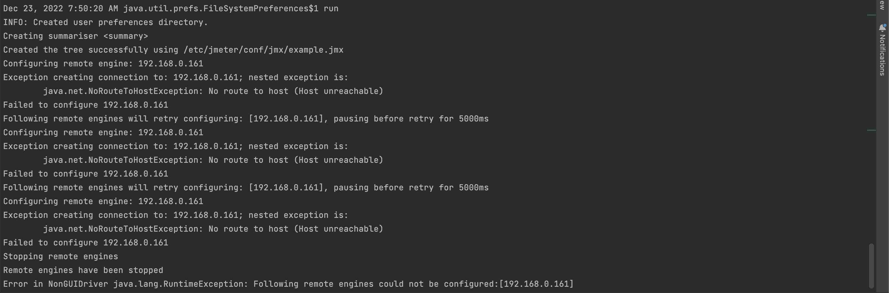

# MightyMeter

- [Introduction](#intro)
- [Requirements](#req)
- [Installation of the Leader](#leader-install)
- [Installation of the Workers](#worker-install)
- [Configuring Your JMX File](#jmx-config)
- [Running Tests](#running-tests)
- [Grafana Dashboards](#grafana-dashboards)
- [Querying the Database](#querying-db)
- [Local Installation](#local-install)
- [Configuration Options](#config-options)
- [Additional Commands](#additional-commands)
- [Common Issues](#common-issues)

## <a name="intro"></a> Introduction

MightyMeter (based on InfluxDB, Grafana and JMeter) is a tool that simplifies functional load
testing and performance measurement with [JMeter](https://jmeter.apache.org/). MightyMeter provides
quick and easy setup of a group of JMeter servers with one central **Leader** node (aka master) managing multiple
**Worker** nodes (aka slaves).

The Leader sends the test configuration to each Worker. As the test runs, Workers send their results
to the Leader, which stores them in an [InfluxDB](https://www.influxdata.com/) database. MightyMeter
enables real-time monitoring of tests through a [Grafana](https://grafana.com/) dashboard that
visualizes statistics from the InfluxDB database. Additional dashboards allow for comparing tests by
application version, user count, etc.

Reports are stored in text and HTML formats, with an APDEX (Application Performance Index) report
accessible via an HTTP server ([NGinx](https://www.nginx.com/)).

## <a name="req"></a> Requirements

- Docker
- The latest version of MightyMeter (download from GitHub)
- Execution permissions for scripts in the `bin` folder

## <a name="leader-install"></a> Installation of the Leader

For the machine intended as the **Leader**, with the hostname **mm.leader.host**, and MightyMeter
downloaded, run the following commands:

```shell
mm.leader.host$ cd bin/leader
mm.leader.host$ mm-leader-install
```

Services on the Leader will be set up as follows:

- **Nginx** on port 80
- **Grafana** on port 3000
- **InfluxDB** on port 8086

Ports can be customized via `_NGINX_PORT`, `_GRAFANA_PORT`, and `_INFLUX_DB_PORT` in the `.defaults`
file. Component versions are specified in `.versions`.

The following Docker volumes are created:

- `mm-jmeter-conf`: stores the JMX and properties files for each test, created at test run.
- `mm-tests-reports`: stores test reports in text and HTML formats.
- `mm-jmeter-logs`: stores JMeter logs.
- `mm-dashboards`: stores Grafana dashboards.
- `mm-metrics-db`: stores the InfluxDB database.

Inspect all volumes with `mm-leader-inspect-vol`.

## <a name="worker-install"></a> Installation of the Workers

For each **Worker** machine with hostnames like **mm.worker.host1**, **mm.worker.host2**, download
MightyMeter and run the following on each Worker:

```shell
mm.worker.host1$ cd bin/worker
mm.worker.host1$ mm-worker-install --host mm.worker.host1
```

Each Worker will create a Docker volume named `mm-jmeter-logs` for log storage. When a Leader and
Worker share a machine, they share the `mm-jmeter-logs` volume.

## <a name="jmx-config"></a> Configuring Your JMX File

To persist results in InfluxDB and enable real-time monitoring in Grafana, include the MightyMeter
listener in your JMX file, as shown in [example.jmx](examples/example.jmx). Only modify:

- **eventTags** variable: set to your chosen value (will appear in the InfluxDB `events` and
  `statistics`).
- Add custom tags in the format `TAG_name=value`.

## <a name="running-tests"></a> Running Tests

To start a test from the Leader, run `mm-leader-run-tests` with options like:

```shell
mm.leader.host$ mm-leader-run-tests \
--duration 3600 \
--num-threads 20 \
--ramp-up 60 \
--leader-host mm.leader.host \
--worker-hosts mm.worker.host1,mm.worker.host2,mm.worker.host3 \
--env Production \
--jmx-file /path/to/jmx-file \
--props-file /path/to/props-file \
--app MyApp \
--app-version 1.0.0 \
--test-name PerformanceTest
```

### Options:

- **duration**: test duration in seconds.
- **num-threads**: threads per Worker (total = num-threads * Worker count).
- **ramp-up**: ramp-up time for threads in seconds.
- **leader-host**: hostname of the Leader.
- **worker-hosts**: comma-separated Worker hostnames.
- **env**: test environment (used in InfluxDB and Grafana filters).
- **app**: application name.
- **app-version**: tested app version.
- **jmx-file**: JMeter configuration file (with listener included).
- **props-file**: additional properties for JMeter.

This command creates an ephemeral Docker container to start a JMeter client (Leader) and coordinates
with active Workers. Monitor tests in real-time on Grafana at `http://localhost:3000` (default
login: `admin/admin`).

## <a name="grafana-dashboards"></a> Grafana Dashboards

MightyMeter provides dashboards for real-time and historical data. You can compare tests by app
version, number of users, and more.

## <a name="querying-db"></a> Querying the Database

Access the InfluxDB console on the Leader with `mm-leader-influxdb-console`. Familiarity with
InfluxDB terms like measurements, series, tags, and fields is helpful. The default database **mm**
contains `statistics` and `events`. `events` logs test start/stop times; `statistics` holds
transaction metrics.

Example:

```shell
mm.leader.host$ mm-leader-influxdb-console

> use mm
> select * from events
> select * from statistics
```

## <a name="local-install"></a> Local Installation

MightyMeter can run on a local machine. Use the machine's IP address instead of "localhost" for
`worker-hosts` and `leader-host` variables.

## <a name="config-options"></a> Configuration Options

Change ports in the **.defaults** file or specify alternative versions in the **.versions** file.

## <a name="additional-commands"></a> Additional Commands

- **Uninstall MightyMeter**: `mm-leader-uninstall` on the Leader, and `mm-worker-uninstall` on
  Workers.
- **Access Worker Logs**:

  ```shell
  mm.worker.host1$ cd bin/worker
  mm.worker.host1$ mm-worker-bash
  root@container# tail -f /var/log/jmeter/jmeter-worker.log
  ```

- **Stop a Test**:

  ```shell
  mm.leader.host$ cd bin/leader
  mm.leader.host$ mm-leader-stop-test
  ```

## <a name="common-issues"></a> Common Issues

Check JMeter logs in Docker volumes. Leader logs are accessible via web at
`https://localhost/mm/logs/`.

Typical issues:

- **Empty Reports**: If no report is generated, and data isn’t saved in InfluxDB or Grafana, check
  the JMX file’s InfluxDB listener. If needed, remove it and see if HTML report generation works.
- **Communication Issues**: Ensure all instances are on the same network, and ports are within the
  valid range.



---

